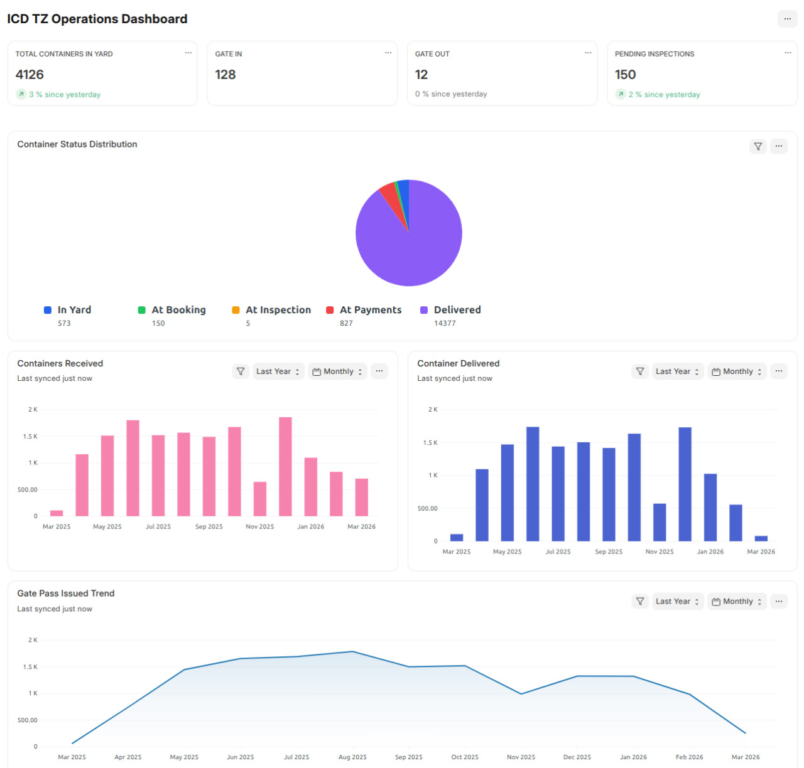

# ICD TZ

ICD TZ is a Frappe / ERPNext application for Inland Container Depot operations in Tanzania. It helps depot teams manage manifests, container reception, yard activities, service billing, gate passes, EDI messages, and operational reporting from one ERPNext-connected workspace.



## Business Summary

ICD TZ is designed for inland container depots that need a structured operating system for receiving containers from port, tracking their movement through the yard, billing depot services, and controlling release at gate-out.

The app extends ERPNext with ICD-specific DocTypes, reports, dashboards, custom fields, billing logic, and EDI message generation. It is not a generic logistics CRM; it is focused on container depot workflows where container status, storage days, C&F parties, clearing agents, service orders, invoices, and gate security all need to stay connected.

Repository evidence shows this app is **ERPNext required**. It depends on ERPNext records such as Sales Order, Sales Invoice, Sales Order Item, Sales Invoice Item, Item, Item Group, Price List, Customer, Vehicle, Driver, and Employee.

## Business Problems This App Solves

| Business problem | How ICD TZ addresses it |
|---|---|
| Container data is scattered across manifests, spreadsheets, gate logs, and billing documents | Provides dedicated Manifest, Container, Container Reception, Movement Order, Booking, Inspection, Service Order, and Gate Pass records |
| Depot teams need visibility of which containers are in the yard and what stage they are in | Tracks container status, location, storage days, booking, inspection, and gate-out state |
| Billing for storage, handling, stripping, verification, removal, and corridor levy is difficult to coordinate manually | Uses ICD TZ Settings, service item setup, Sales Orders, and Sales Invoices to link operational services with ERPNext billing |
| Containers may be released before required charges are cleared | Gate Pass validation checks storage, reception, booking, inspection, removal, and levy invoices before release |
| Manifest import is time-consuming | Manifest logic reads attached spreadsheet workbooks and populates container, MBL, HBL, and consignee-related child records |
| Shipping line or terminal EDI messages need to be generated consistently | CODECO and COREOR generators create UN/EDIFACT-style EDI messages from operational records |
| Managers need an operational dashboard instead of only transaction lists | Provides an ICD workspace, dashboard cards, number cards, dashboard charts, and script reports |

## Who This App Is For

| Audience | Fit |
|---|---|
| Inland Container Depots | Strong fit for depots that receive, store, inspect, strip, bill, and release containers |
| ERPNext implementers | Useful when implementing depot operations on top of ERPNext Accounts and Selling |
| Operations managers | Useful for visibility into gate-in, gate-out, stock, inspections, bookings, and revenue |
| Finance and billing teams | Useful where depot service charges must connect to Sales Orders and Sales Invoices |
| IT and integration teams | Useful where SFTP / SSH EDI connectivity and structured EDI output are required |

## Who This App Is Not For

| Scenario | Reason |
|---|---|
| A company not using ERPNext | The app relies on ERPNext selling, accounts, item, customer, vehicle, and driver records |
| A general freight forwarding CRM | The app is centered on ICD container yard operations, not broad sales pipeline management |
| A shipping line core system replacement | It creates and tracks ICD-side depot records and messages; it is not a carrier TOS replacement |
| A site without agreed billing rules | Storage days, service pricing, levy countries, and expiry policies must be configured before production use |

## Business Benefits

| Benefit | Business impact |
|---|---|
| Centralized ICD records | Reduces dependency on disconnected spreadsheets and manual status updates |
| Container lifecycle tracking | Gives teams a clearer view from manifest to reception, yard activity, billing, and gate-out |
| ERPNext billing connection | Links operational services to Sales Orders and Sales Invoices |
| Gate-out payment control | Helps prevent release when required invoices or service charges are not cleared |
| EDI message generation | Supports structured CODECO and COREOR file creation from depot transactions |
| Dashboard and reports | Gives managers faster access to stock, movement, booking, revenue, and gate pass information |

## Before and After

| Before ICD TZ | With ICD TZ |
|---|---|
| Manifest data is retyped or handled in spreadsheets | Manifest spreadsheet data can populate ICD records |
| Container status depends on manual communication | Container status is updated through reception, booking, inspection, billing, and gate pass activity |
| Billing teams manually identify billable services | Service Order and Sales Order logic assembles storage and depot service charges |
| Gate staff manually verify release readiness | Gate Pass validations check pending charges and mandatory fields |
| EDI files are prepared outside the operating workflow | CODECO and COREOR files can be generated from operational documents |
| Management reviews multiple lists | Dashboards and script reports consolidate operational visibility |

## Typical Use Cases

| Use case | Supported by |
|---|---|
| Import vessel or container manifest details | Manifest DocType and spreadsheet extraction logic |
| Create movement orders for containers coming from port | Container Movement Order DocType |
| Record gate-in / reception | Container Reception DocType and CODECO gate-in generation |
| Track container stock and location | Container and Container Location DocTypes |
| Book stripping or customs verification | In Yard Container Booking and Container Inspection DocTypes |
| Generate billable service orders | Service Order DocType and ICD TZ Settings |
| Create ERPNext billing documents | Sales Order custom methods and Sales Invoice event hooks |
| Control gate-out | Gate Pass validation and auto-expiry logic |
| Monitor depot activity | ICD workspace, dashboards, number cards, charts, and reports |

## Example Business Workflow

1. The operations team uploads or enters manifest details, including containers, Master BLs, House BLs, consignees, and cargo information.
2. A Container Movement Order is created to authorize movement from port to ICD.
3. At arrival, the Container Reception record captures gate-in details, transport information, seals, weights, and EDI output when enabled.
4. The system creates or updates Container records and tracks the container in the yard.
5. The yard team creates bookings, inspections, verification movements, or service orders as needed.
6. Billing users generate Sales Orders and Sales Invoices for storage, reception, stripping, verification, removal, corridor levy, and other configured services.
7. Gate staff create a Gate Pass for release.
8. Gate Pass submission validates pending charges and generates gate-out EDI when enabled.
9. Managers review stock, movements, gate passes, and revenue through dashboards and reports.

## ERPNext Value Addition

ICD TZ extends ERPNext for a container depot operating model. It adds ICD-specific operational documents while using ERPNext for selling, invoicing, items, price lists, customers, vehicles, drivers, and employees.

| ERPNext area | ICD TZ value addition |
|---|---|
| Sales Order | Adds container, MBL, HBL, consignee, C&F company fields and custom update item logic |
| Sales Invoice | Adds container, MBL, HBL, consignee, C&F company fields and updates linked ICD records on submit |
| Sales Order Item / Sales Invoice Item | Adds container number, container ID, and child reference fields |
| Item / Item Group | Creates ICD Services item group and default ICD service items |
| Price List | Creates Standard Selling when missing during install |
| Customer | Consignee and C&F company logic can create linked ERPNext Customer records |
| Vehicle / Driver | Adds ICD-focused vehicle ownership and driver property changes |
| Employee | Exposed in the ICD workspace for manpower setup |

## Stand-alone Value

ICD TZ should not be treated as a standalone Frappe-only app. The repository shows direct ERPNext dependencies through custom fields, hooks, CI install flow, workspace links, and business logic that references ERPNext selling, accounts, stock, vehicle, and customer records.

## Decision Guide

| Question | Yes / No |
|---|---|
| Do you operate an inland container depot or similar container yard? | |
| Do you need container-level tracking from manifest to gate-out? | |
| Do you already use ERPNext, or are you implementing ERPNext for operations and billing? | |
| Do gate staff need payment validation before release? | |
| Do you bill storage, stripping, customs verification, removal, corridor levy, or handling services? | |
| Do you need CODECO or COREOR-style EDI output? | |
| Do managers need stock, movement, booking, inspection, and revenue reports? | |

If most answers are "Yes", ICD TZ is likely worth evaluating. If ERPNext is not part of the target stack, confirm feasibility before adoption.

## Expected Business Outcomes

ICD TZ can help improve operational control, billing traceability, and release discipline in an ERPNext-based ICD implementation. Expected outcomes include:

- Better visibility into current containers, received containers, exited containers, bookings, inspections, and gate passes.
- More consistent billing preparation for depot services.
- Reduced release risk by validating pending invoices and service charges before gate-out.
- More structured EDI file generation for gate-in, gate-out, and release-order workflows.
- Cleaner handoff between operations, finance, yard, and gate teams.

## Screenshots / Visual Walkthrough

The repository includes one dashboard screenshot:


Suggested screenshots to add before publishing:

| Screenshot | Status |
|---|---|
| Manifest import screen | To confirm |
| Container Reception form | To confirm |
| Container lifecycle view | To confirm |
| Service Order and generated Sales Order | To confirm |
| Gate Pass validation flow | To confirm |
| EDI Settings | To confirm |

## Demo Scenario

A practical demo can be built around this flow:

1. Configure ICD TZ Settings, service items, storage day rules, EDI Settings, and gate pass expiry hours.
2. Upload a sample manifest workbook and extract container, MBL, HBL, and consignee data.
3. Create a Container Movement Order.
4. Submit a Container Reception and confirm the container appears in the yard.
5. Create an In Yard Container Booking or Container Inspection.
6. Generate a Service Order and Sales Order for billable services.
7. Submit a Sales Invoice and confirm related ICD records are updated.
8. Create and submit a Gate Pass.
9. Review dashboard cards, charts, and script reports.

## Implementation Effort

| Area | Effort | Notes |
|---|---|---|
| ERPNext site setup | Medium | Requires a working Frappe / ERPNext v15 bench |
| App installation | Low | Standard bench install once dependencies are available |
| ICD master data setup | Medium | Configure locations, states, transporters, agents, officers, document types, service items, and price list |
| Billing rules | High | Storage windows, service pricing, levy rules, and charging policies need business confirmation |
| EDI setup | Medium to High | Requires sender / receiver IDs, connection type, SFTP / SSH or email details, credentials, and partner testing |
| User training | Medium | Operations, billing, and gate users need process training |
| Data migration | Depends | Existing manifests, container history, customer data, and open invoices may need cleanup |
| Reporting rollout | Medium | Users should validate report definitions against local management needs |

## What Needs to Be Ready Before Implementation

- ERPNext v15 bench and site.
- Confirmed depot operating workflow from manifest to gate-out.
- Master data for consignees, C&F companies, clearing agents, transporters, vehicles, drivers, employees, locations, and document types.
- ICD service catalog, Item Prices, price list, and billing policy.
- Storage-day rules by destination.
- Corridor levy countries and eligibility rules.
- EDI partner details, sender / receiver IDs, connection method, credentials, destination directory or email recipients.
- User roles and approval responsibilities.
- Sample manifests and test cases for gate-in, billing, and gate-out.

## Risks and Considerations

| Risk / consideration | Why it matters |
|---|---|
| ERPNext dependency | The app references ERPNext DocTypes directly, so install ERPNext first |
| Pricing configuration | Missing ICD TZ Settings entries can block service and billing workflows |
| EDI partner testing | Generated files should be validated with receiving parties before production use |
| Gate pass release control | Gate-out validation depends on invoices and linked service records being accurately maintained |
| Manifest workbook format | Spreadsheet extraction depends on expected sheet and column layout |
| Permissions | Repository permissions are mostly System Manager-focused and may need production role design |
| Openpyxl availability | Manifest import uses `openpyxl`; confirm it is available in the target bench |
| Data cleanup | Imported manifests and linked ERPNext records need clean master data |

## Frequently Asked Business Questions

### Do we need ERPNext?

Yes. Repository evidence shows ERPNext is required.

### Will this replace ERPNext?

No. ICD TZ extends ERPNext with inland container depot operations. ERPNext remains the base system for selling, billing, customers, items, price lists, vehicles, and users.

### Can it be customized?

Yes. It is a Frappe app with DocTypes, hooks, scripts, reports, and Python business logic. Customization should preserve the core billing and gate-out validation flow.

### Can managers get reports?

Yes. The app includes dashboard cards, number cards, charts, and script reports for container stock, gate movements, bookings, stripped containers, loose cargo, and revenue.

### Can existing spreadsheet data be migrated?

The Manifest DocType includes workbook extraction logic. A migration plan should still confirm source spreadsheet layouts, historical records, and required data cleanup.

### Does it support EDI?

Yes. The app includes CODECO gate-in / gate-out generation, COREOR generation, EDI Settings, and SFTP / SSH connection testing.

### What should we prepare before implementation?

Prepare ERPNext, ICD billing policies, master data, service items, price lists, storage rules, gate pass policies, EDI partner details, and real test scenarios.

---

## Key Features

- Manifest management with spreadsheet extraction into container, MBL, HBL, and consignee-related records.
- Container movement orders, reception, lifecycle tracking, location tracking, and state tracking.
- In-yard booking, container inspection, verification movement, and loose cargo tracking.
- Service Order generation for reception, booking, inspection, storage, removal, corridor levy, and related ICD services.
- ERPNext Sales Order and Sales Invoice integration with container references.
- Gate Pass validation for pending storage, reception, booking, inspection, removal, and levy charges.
- CODECO and COREOR EDI message generation.
- EDI Settings with sender / receiver IDs, connection type, SFTP / SSH connection test, directory, email recipients, and enable flag.
- ICD workspace, dashboard cards, number cards, dashboard charts, and script reports.
- Install and migration hooks for custom fields, property setters, item groups, services, container states, and ICD settings defaults.

## Compatibility

| Component | Evidence / recommendation |
|---|---|
| Frappe | CI initializes Frappe with `--frappe-branch version-15` |
| ERPNext | CI installs ERPNext `version-15` before installing ICD TZ |
| Python | `pyproject.toml` requires Python `>=3.10`; CI uses Python 3.10 |
| Node.js | CI uses Node 18 for tests; release workflow uses Node 20 |
| MariaDB | CI uses MariaDB 10.6 |
| Redis | CI uses Redis services for cache and queue |
| App dependency | `paramiko>=3.0.0` for SFTP / SSH EDI connection testing |
| Manifest import | Uses `openpyxl` in manifest extraction logic; confirm dependency availability in target environment |

## App Mode

**ERPNext required.**

The app customizes and references ERPNext DocTypes such as Sales Order, Sales Invoice, Sales Order Item, Sales Invoice Item, Item, Item Group, Price List, Customer, Vehicle, Driver, and Employee. The CI workflow installs ERPNext before installing `icd_tz`.

## Installation

Install ERPNext first, then install ICD TZ.

```bash
bench get-app --branch version-15 erpnext
bench --site your-site.local install-app erpnext

bench get-app --branch version-15 https://github.com/Aakvatech-Limited/icd_tz.git
bench --site your-site.local install-app icd_tz
bench --site your-site.local migrate
```

For a local checkout:

```bash
bench get-app icd_tz /path/to/icd_tz
bench --site your-site.local install-app icd_tz
bench --site your-site.local migrate
```

## Configuration

After installation, configure these areas before production use:

| Configuration area | What to set |
|---|---|
| ICD TZ Settings | Default price list, storage day rules, service pricing criteria, LCL criteria, corridor levy countries, signature validation, gate pass expiry hours |
| EDI Settings | URL, port, source IP, authentication method, password or key, directory, sender ID, receiver ID, enable EDI, connection type, receiver email and CC |
| Item Prices | Prices for the ICD service items created by patches |
| Master data | Consignees, C&F companies, clearing agents, transporters, vehicles, drivers, security officers, locations, document types |
| ERPNext selling setup | Customers, price list, taxes, accounts, currency, and invoice workflow |
| Permissions | Production roles for operations, billing, gate, management, and system administration |

## Usage

Use the ICD workspace to access operational areas:

| Area | Primary records |
|---|---|
| Container Movement Handling | Manifest, Container Movement Order, Container Reception |
| Container and consignee | Container, Consignee |
| Booking and Inspection | In Yard Container Booking, Container Inspection |
| Billing Part | Service Order, Sales Order, Sales Invoice |
| Checkpoint | Gate Pass |
| Transport Info | Transporter, Vehicle, Driver |
| Clearing and Forwarding | Clearing and Forwarding Company, Clearing Agent |
| Man Power | Employee, Security Officer |
| Condition and Location | Container State, Container Location |
| Item and Prices | Item, Item Price |
| Settings | ICD TZ Settings, EDI Settings, Document Type |

## Modules and DocTypes

| Area | DocTypes | Purpose |
|---|---|---|
| Manifest and BL | Manifest, Master BL, House BL, HBL Container, Containers Detail, HouseBI | Capture manifest, MBL, HBL, cargo, and container details |
| Container operations | Container, Container Movement Order, Container Reception, Container Location, Container State, Condition state | Track container movement, status, location, condition, and reception |
| Yard services | In Yard Container Booking, Booking detail, Container Inspection, Container Inspection Detail, Container Verification Movement | Manage stripping, verification, inspection, and internal yard activities |
| Billing operations | Service Order, Service Order Detail, Container Service Detail, ICD TZ Service Detail, ICD TZ Loose Detail | Collect and generate billable ICD service lines |
| Gate operations | Gate Pass | Control gate-out and container release |
| Parties and people | Consignee, Clearing and Forwarding Company, Clearing Agent, Transporter, Security officer | Maintain operational counterparties and staff-facing records |
| Settings and references | ICD TZ Settings, ICD TZ Settings Detail, EDI Settings, Document Type, Document Attachment, Corridor Levy Country | Configure service pricing, EDI, documents, attachments, and levy rules |

Submittable operational DocTypes include Manifest, Container Movement Order, Container Reception, In Yard Container Booking, Container Inspection, Container Verification Movement, Service Order, and Gate Pass.

## ERPNext Integration Details

| ERPNext object | Integration |
|---|---|
| Sales Order | Custom fields for consignee, C&F company, MBL, HBL; custom JavaScript; list script; event hooks; custom method to update items |
| Sales Invoice | Custom fields for consignee, C&F company, MBL, HBL; event hooks update linked ICD records after submit |
| Sales Order Item | Custom fields for container number, container ID, and child references |
| Sales Invoice Item | Custom fields for container number, container ID, and child references |
| Item Group | Patch creates `ICD Services` |
| Item | Patch creates default ICD service items |
| Price List | Install hook creates `Standard Selling` when missing |
| Customer | Consignee and C&F company code can create or link Customer records |
| Vehicle | Custom fields and property setters support ICD truck / trailer and owner handling |
| Driver | Custom field and property setters support driver ownership and license requirements |
| Employee | Exposed in the ICD workspace for manpower setup |

## Custom Fields and Fixtures

The repository stores custom field definitions under `icd_tz/patches/custom_fields_json` and creates them through install and migrate hooks.

| Target DocType | Customization summary |
|---|---|
| Sales Order | Consignee, C&F company, MBL, HBL, Update Items button |
| Sales Invoice | Consignee, C&F company, MBL, HBL |
| Sales Order Item | Container number, container ID, container child references |
| Sales Invoice Item | Container number, container ID, container child references |
| Vehicle | Disabled, Is Truck, Is Trailer, Vehicle Owner |
| Driver | Vehicle Owner |

Property setter patches adjust Sales Order and Sales Invoice field order, Driver naming / required fields, and selected Vehicle field requirements.

## Permissions

Most parent DocTypes in the repository grant System Manager permissions by default. Child table DocTypes generally have no standalone role entries. Production sites should define and test role profiles for:

- ICD operations users.
- Yard supervisors.
- Billing and accounts users.
- Gate officers and security officers.
- Managers and report viewers.
- System administrators.

## Reports and Dashboards

### Script Reports

| Report | Ref DocType |
|---|---|
| Received Containers | Container |
| Current Container Stock | Container |
| Container Status Flow | Container |
| Exited Containers | Gate Pass |
| Gate Out Pass | Gate Pass |
| Daily Stripped Containers | Gate Pass |
| Loose Cargo Tracking | Gate Pass |
| Container Booking | In Yard Container Booking |
| Container and Interchange Document Booking Datewise | In Yard Container Booking |
| Revenue Summary | Sales Invoice |

### Dashboards and Cards

| Asset | Purpose |
|---|---|
| ICD workspace | Navigation hub for ICD operations, billing, checkpoint, master data, and settings |
| ICD TZ Operations dashboard | Operational dashboard |
| Number cards | Total Containers in Yard, Gate In, Gate Out, Pending Inspections |
| Dashboard charts | Container Delivered, Containers Received, Container Status Distribution, Gate Pass Issued Trend |

## APIs

Whitelisted and callable methods include:

| Method | Purpose |
|---|---|
| `icd_tz.icd_tz.api.edi_codeco.generate_codeco_gate_in` | Generate CODECO gate-in EDI file |
| `icd_tz.icd_tz.api.edi_codeco.generate_codeco_gate_out` | Generate CODECO gate-out EDI file |
| `icd_tz.icd_tz.api.edi_coreor.generate_coreor_edi` | Generate COREOR EDI file |
| `icd_tz.icd_tz.api.sales_order.update_items_on_sales_order` | Rebuild Sales Order items from linked ICD service and storage logic |
| `icd_tz.icd_tz.api.sales_order.make_sales_order` | Create Sales Order from ICD billing context |
| `icd_tz.icd_tz.api.sales_order.create_sales_order` | Wrapper to create Sales Order from passed data |
| `icd_tz.icd_tz.api.utils.submit_doc` | Submit a document by DocType and name |
| `Container.get_place_of_destination` | Return configured storage destinations |
| `Container Inspection.create_bulk_inspections` | Create inspections in bulk |
| `Container Movement Order.get_manifest_details` | Fetch manifest details for movement order flow |
| `Container Reception.get_container_details` | Fetch container details from manifest and container number |
| `EDI Settings.try_edi_connection` | Test configured SFTP / SSH connection |
| `Gate Pass.create_getpass_for_empty_container` | Create a gate pass for an empty container |
| `Gate Pass.auto_expire_gate_passes` | Auto-expire submitted gate passes past expiry time |
| `In Yard Container Booking.create_bulk_bookings` | Create bookings in bulk |
| `Manifest.extract_data_from_manifest_file` | Extract spreadsheet data into manifest child tables |
| `Service Order.create_bulk_service_orders` | Create service orders in bulk |

## Hooks and Events

| Hook area | Details |
|---|---|
| `before_install` | Creates `Standard Selling` price list if missing |
| `after_install` | Runs custom field and property setter creation |
| `after_migrate` | Re-runs custom field and property setter creation |
| `doctype_js` | Adds Sales Order client script |
| `doctype_list_js` | Adds list scripts for Custom Field, Property Setter, and Sales Order |
| `doc_events` | Sales Invoice `before_save` and `on_submit`; Sales Order `before_save` and `on_trash` |
| `patches.txt` | Creates item group, ICD service items, container states, and updates ICD TZ Settings |

## Background Jobs

| Schedule | Job |
|---|---|
| Hourly | `icd_tz.icd_tz.doctype.gate_pass.gate_pass.auto_expire_gate_passes` |
| Every 2 hours | `icd_tz.icd_tz.doctype.container.container.daily_update_date_container_stay` |
| Every 2 hours | `icd_tz.icd_tz.doctype.consignee.consignee.create_customer` |

## Developer Setup

```bash
bench init --frappe-branch version-15 frappe-bench
cd frappe-bench

bench get-app --branch version-15 erpnext
bench get-app icd_tz /path/to/icd_tz

bench new-site your-site.local
bench --site your-site.local install-app erpnext
bench --site your-site.local install-app icd_tz
bench --site your-site.local migrate
```

Run checks used by the repository:

```bash
pre-commit run --all-files
bench --site your-site.local migrate
bench --site your-site.local list-apps
```

## Project Structure

```text
icd_tz/
  hooks.py                         Frappe hooks, events, scheduler jobs
  install.py                       Install-time setup
  patches.txt                      Patch registration
  patches/                         Custom fields, property setters, default data patches
  icd_tz/
    api/                           Sales, invoice, EDI, and utility APIs
    doctype/                       ICD TZ DocTypes and business logic
    report/                        Script reports
    workspace/                     ICD workspace
    dashboard_card/                Dashboard cards
    number_card/                   Number cards
    dashboard_chart/               Dashboard charts
    icd_tz_dashboard/              ICD TZ dashboard definition
  docs/
    dashboard.png                  README dashboard screenshot
```

## Migration Notes

- Run `bench --site your-site.local migrate` after installation and after pulling new changes.
- Custom fields and property setters are registered in both `after_install` and `after_migrate`.
- Patches create default item group, service items, container states, and ICD TZ Settings references.
- Validate custom fields on Sales Order, Sales Invoice, Sales Order Item, Sales Invoice Item, Vehicle, and Driver after migration.
- Confirm open operational documents before changing billing rules or gate pass validation policies.

## Upgrade Guide

1. Back up the ERPNext site database and files.
2. Pull the target app branch.
3. Run `bench --site your-site.local migrate`.
4. Rebuild assets if client scripts or desk assets change.
5. Review ICD TZ Settings, EDI Settings, custom fields, property setters, and service item mappings.
6. Test manifest import, container reception, service order, invoice submit, and gate pass submission in staging.
7. Confirm reports and dashboards still load.

## Uninstallation

No custom uninstall hooks are defined in the repository. Before uninstalling, confirm how you want to handle:

- ICD operational DocTypes and submitted documents.
- Custom fields on ERPNext Sales Order, Sales Invoice, Sales Order Item, Sales Invoice Item, Vehicle, and Driver.
- Property setters.
- Created Items, Item Group, Price List, and Customer links.
- Reports, dashboards, and workspace records.

Typical command:

```bash
bench --site your-site.local uninstall-app icd_tz
```

Use this only after a backup and business approval.

## Troubleshooting

| Symptom | What to check |
|---|---|
| App install fails | Confirm ERPNext is installed before `icd_tz` |
| Manifest extraction fails | Confirm workbook format, attached file path, and `openpyxl` availability |
| Service Order cannot generate services | Check ICD TZ Settings service criteria, storage days, price list, and service item mappings |
| Sales Order items are missing | Use the Sales Order update items action and confirm linked containers / service orders are submitted |
| Sales Invoice does not update ICD records | Confirm invoice items contain container fields and service item codes match ICD TZ Settings |
| Gate Pass cannot submit | Review pending storage, reception, booking, inspection, removal, and corridor levy invoices |
| EDI file missing | Confirm EDI Settings, enable flag, connection type, sender ID, receiver ID, and generation errors |
| Gate Pass auto-cancels | Check gate pass expiry hours and whether gate confirmation happened before expiry |

## Security

- EDI Settings include passwords and authentication keys; restrict access to trusted administrators.
- Review the SFTP / SSH host key policy and credential storage expectations before production use.
- Gate Pass validation is business-critical; test payment and invoice edge cases before go-live.
- Permissions should be reviewed because repository defaults are mostly System Manager-focused.
- Review generated EDI files for sensitive operational data before enabling external transmission.

## Repository Evidence Reviewed

| File / area | Evidence found |
|---|---|
| `pyproject.toml` | App name `icd_tz`, Python `>=3.10`, dependency `paramiko>=3.0.0`, README metadata |
| `icd_tz/hooks.py` | App metadata, ERPNext custom scripts, install hooks, doc events, scheduler events |
| `.github/workflows/ci.yml` | Frappe version-15, ERPNext version-15, Python 3.10, Node 18, MariaDB 10.6, Redis |
| `icd_tz/install.py` | Creates `Standard Selling` price list |
| `icd_tz/patches.txt` | Registers default item group, service items, container states, ICD settings update |
| `icd_tz/patches/create_icd_services.py` | Creates ICD service Items for transport, levy, removal, handling, stripping, verification, and storage |
| `icd_tz/patches/custom_fields_json/*` | Adds container and ICD party fields to Sales Order, Sales Invoice, item rows, Vehicle, and Driver |
| `icd_tz/patches/property_setters_json/*` | Adjusts Sales Order / Sales Invoice field order and selected Vehicle / Driver behavior |
| `icd_tz/icd_tz/doctype/*/*.json` | Defines ICD DocTypes, child tables, submittable operations, settings, and permissions |
| `icd_tz/icd_tz/doctype/manifest/manifest.py` | Reads manifest workbook data and creates consignee-related entries |
| `icd_tz/icd_tz/doctype/container_reception/container_reception.py` | Handles reception, container creation, EDI gate-in, storage-day updates, cancellation checks |
| `icd_tz/icd_tz/doctype/container/container.py` | Tracks status, storage days, billing flags, destination validation, and scheduled stay updates |
| `icd_tz/icd_tz/doctype/service_order/service_order.py` | Builds service lines and can create gate pass records |
| `icd_tz/icd_tz/doctype/gate_pass/gate_pass.py` | Validates pending payments, generates CODECO gate-out, updates status, auto-expires passes |
| `icd_tz/icd_tz/api/sales_order.py` | Creates and updates Sales Orders based on storage and service logic |
| `icd_tz/icd_tz/api/sales_invoice.py` | Updates ICD references when Sales Invoices are submitted |
| `icd_tz/icd_tz/api/edi_codeco.py` | Generates CODECO D95B gate-in / gate-out messages |
| `icd_tz/icd_tz/api/edi_coreor.py` | Generates COREOR D00B release-order messages |
| `icd_tz/icd_tz/doctype/edi_settings/*` | Stores EDI connection and sender / receiver configuration; tests SFTP / SSH connection |
| `icd_tz/icd_tz/report/*` | Provides script reports for stock, movements, bookings, gate passes, loose cargo, and revenue |
| `icd_tz/icd_tz/workspace/icd/icd.json` | Defines ICD workspace navigation |
| `icd_tz/icd_tz/dashboard_card`, `number_card`, `dashboard_chart` | Defines dashboard KPIs and charts |
| `LICENSE.md`, `license.txt`, `hooks.py` | License stated as MIT |

## To Confirm Before Publishing

- Exact production branch naming and repository URL to publish in installation commands.
- Maintainer contact and support channel.
- Whether `openpyxl` should be explicitly added to project dependencies.
- Whether README should use "Inland Container Depot" or "Inland Container Department" consistently; repository metadata uses both.
- Role and permission matrix for non-System Manager users.
- Final screenshot set and demo data.
- EDI partner-specific file naming, directory, transmission, and acknowledgement requirements.
- Supported ERPNext minor versions within version 15.
- Whether the current app version `0.0.1` is the intended public version.

## Support and Maintenance

For implementation support, clarify the responsible maintainer or partner before production rollout. Repository metadata lists:

| Field | Value |
|---|---|
| Publisher | elius mgani |
| Email | emgani@aakvatech.com |
| License | MIT |

## Contributing

Recommended contribution flow:

1. Create a branch from the target version branch.
2. Run `pre-commit run --all-files`.
3. Test installation or migration on a Frappe / ERPNext v15 site.
4. Test the operational flow touched by the change.
5. Open a pull request with screenshots or evidence for UI and report changes.

## Versioning

The package version is stored in `icd_tz/__init__.py`. Repository workflows reference semantic-release and promotion branches such as `version-15`, `version-16`, and `production`.

Current repository version:

```text
0.0.1
```

## License

MIT

## Maintainers

- elius mgani, `emgani@aakvatech.com`
- Organization / implementation partner: To confirm before publishing
